Componentes do Grupo

BRENNO DE FARO VIEIRA

DAVI SOUZA FONTES SANTOS

JOSÉ FREIRE FALCÃO NETO

HUMBERTO DA CONCEIÇÃO JÚNIOR

NEWTON SOUZA SANTANA JÚNIOR


**ATIVIDADE 3 -** 

**Uso de Testes de Mutação para avaliar a qualidade dos testes no desenvolvimento de software.**


**Sumário**

[**1. Introdução	2**](#_afughoxn3n3z)

[**2. Projeto	2**](#_v2y9taphn6ep)

[**3. Mutantes	9**](#_b9nccsvlcg9w)

[3.1. Mutações equivalentes e não equivalentes	10](#_c0ef2323tdr1)

[3.2. Comparação com outras técnicas de testes de software.	11](#_f6fbpadwqgxa)

[3.3. Mutações da função logarithm()	11](#_6n8kgrlzlcdy)

[**4. Melhorias	12**](#_keq7539eqiwr)

[**5. Resultados	13**](#_oda1roa0vmrw)

[**6. Referências	14**](#_lf8h3cyzrgsq)

[**7. Como executar o projeto	15**](#_run)


## 1. <a name="_afughoxn3n3z"></a>Introdução
Os “Testes de Mutação” são uma técnica avançada utilizada para avaliar a eficácia dos casos de teste existentes em um projeto de software. Através da inserção proposital de defeitos — conhecidos como mutantes — é possível analisar até que ponto os testes aplicados conseguem identificar falhas e garantir a qualidade do código. Esta abordagem permite não apenas validar os testes existentes, mas também identificar oportunidades de melhoria na cobertura e na robustez dos testes.

Para esta atividade, escolhemos como alvo o repositório “python-testing-101”. O principal objetivo deste repositório é fornecer exemplos práticos para iniciantes e profissionais que desejam aprender sobre testes automatizados com Python. O repositório está subdividido em três pastas, cada uma utilizando uma abordagem distinta para realização dos testes: doctest, pytest ou unittest. Todos os 3 exemplos são baseados em códigos simples de funções matemáticas básicas, o que permite uma compreensão rápida e direta do funcionamento dos testes e facilita a execução das etapas de teste de mutação.

Este tutorial tem como objetivo documentar todas as etapas realizadas na atividade, incluindo: a execução do roteiro de testes de mutação apresentado no vídeo de referência, a análise dos mutantes detectados e vivos, a identificação de limitações nos casos de teste originais e a implementação de melhorias nos testes. 

Abaixo está o link do repositório github do projeto e vídeo tutorial respectivamente:

- <https://github.com/brenofaro/Teste_Software_Mutantes_2025_vieira_brenno.git>
- <https://drive.google.com/file/d/1J7h5H0LGYI7AC5iKur01EMzZBJFJ9gxY/view?usp=sharing>


## 2. <a name="_v2y9taphn6ep"></a>Projeto
No projeto base de estudo, foi feito uma calculadora padrão usando python. Nele, foram definidos dois scripts: **calc\_function** e **calc\_class.** A primeira, **class\_function,** é onde foram criadas funções matemáticas básicas. Já na segunda classe, **calc\_class**, é a classe responsável por chamar as funções previamente definidas na outra classe. Segue o código:

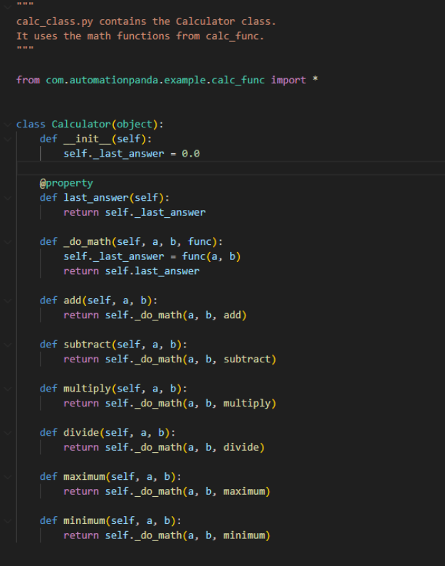

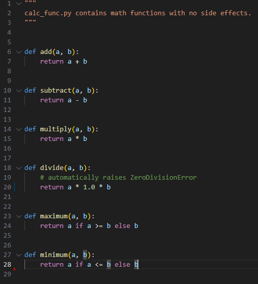


Dentro da subdivisão focada em pytest e tendo como base essas funções, foram criados alguns casos de teste utilizando o pytest para verificar a implementação desse projeto. Os casos definidos são:\
\
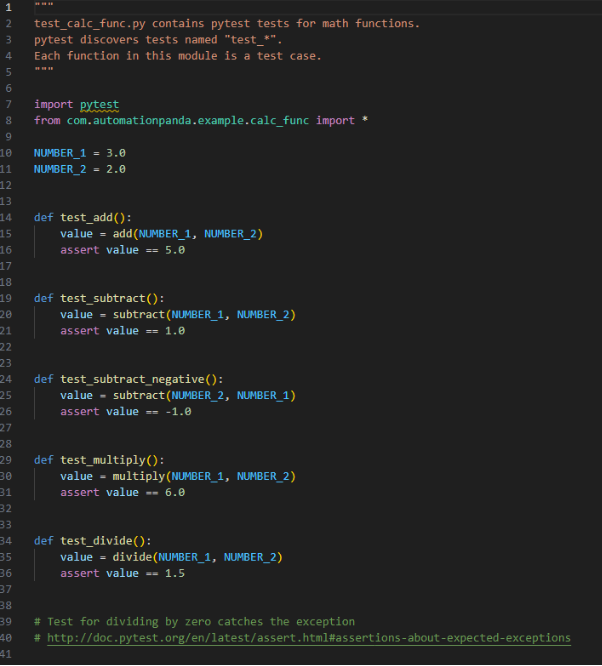

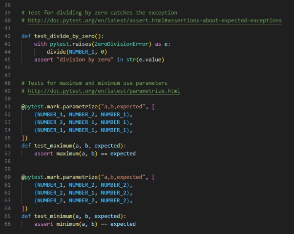

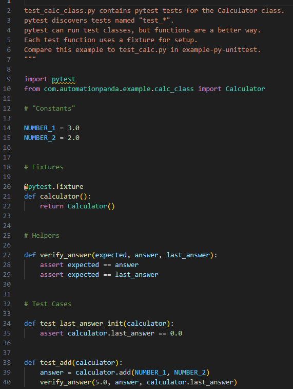

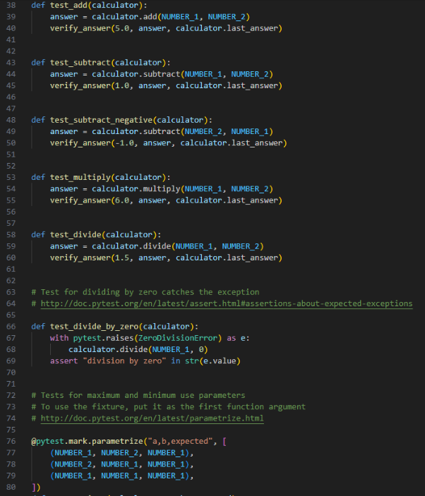

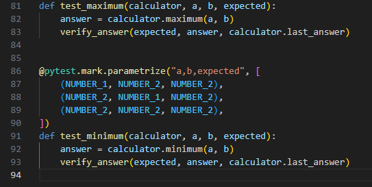

Como as funções do projeto são relativamente simples, optamos por criar uma função de logaritmo, juntamente com seus respectivos casos de teste, de modo que ao executar o comando mutmut fossem geradas mais mutações para posterior análise.

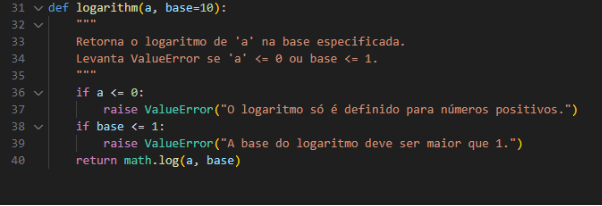


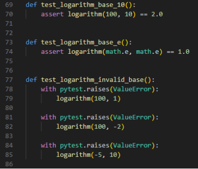


## 3. <a name="_b9nccsvlcg9w"></a>Mutantes
Com todos os casos de teste e com o código fonte, foi possível utilizar a biblioteca mutmut para criar mutações no código e verificar se os testes eram capazes de detectar a existência dos mutantes. Dessa forma, o **mutmut** gerou 19 mutantes em que 10 sobreviveram.

A biblioteca mutmut usada aplica automaticamente diferentes operadores de mutação sobre o código da calculadora implementada. Temos como exemplos de mutações a troca de operadores aritméticos (+ por - ou \*), alteração de valores constantes, substituição de retornos por valores fixos, inversão de condições booleanas. Esse resultado mostra que mesmo que os testes escritos a princípio apresentem 100% de cobertura de código, eles não foram robustos o bastante para identificar todas as falhas introduzidas pelos mutantes. Ou seja, cobertura de código não é sinônimo de qualidade de testes, pois os casos criados podem verificar de forma superficial o comportamento das funções.

A análise dos mutantes sobreviventes indica a necessidade de criação ou aprimoramento de testes, considerando casos de borda e entradas inesperadas. Assim, a taxa de sobrevivência dos mutantes pode ser reduzida e a confiabilidade da suíte de testes pode ser aumentada.


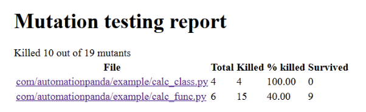
### 3.1. <a name="_c0ef2323tdr1"></a>Mutações equivalentes e não equivalentes
**Mutações equivalentes** são aquelas em que o código alterado pela mutação não produz um resultado diferente do código original. Ou seja, os códigos são equivalentes.

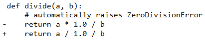

Por exemplo, nesse caso, a alteração da multiplicação **(\*)** pela divisão **(/)** não modifica o resultado da operação** pois o 1 é um número neutro e acaba não alterando. Por conta disso, esses testes não podem ser mortos.

**Mutações não-equivalentes** são aquelas, em que, mesmo após a realização de alterações no código por meio de mutantes, os casos de testes são incapazes de distinguir o programa original do programa mutante. Por conta disso, é necessário criar novos casos de teste, a fim de aumentar a eficiência dos mesmos na detecção dos mutantes.


### 3.2. <a name="_f6fbpadwqgxa"></a>Comparação com outras técnicas de testes de software.
Diferentemente de outras técnicas de teste de software, como os testes de caixa branca, caixa preta ou testes de integração, o objetivo do teste de mutação não é analisar o código final de produção, mas sim verificar a qualidade dos testes e prevenir a ocorrência de erros adicionais durante o desenvolvimento e a modificação do código fonte.
### 3.3. <a name="_6n8kgrlzlcdy"></a>Mutações da função logarithm()
O mutmut gerou mutações relacionadas principalmente às condições de entrada e às mensagens de erro. Abaixo estão os mutantes relevantes e como foram tratados:

- **Mutante 13:** (base=10 → base=11)

  Esse mutante sobreviveu porque não havia casos de teste cobrindo explicitamente o uso da base padrão (10).

- **Mutante 14:** (if a <= 0: → if a < 0:)

Nesse caso, o valor a = 0 não geraria exceção.

- **Mutante 15:** (if a <= 0: → if a <= 1:)

Esse mutante considerava a = 1 como inválido, embora matematicamente log(1) = 0.

- **Mutante 16:** (alteração na mensagem de erro de a <= 0)

O mutante apenas modificou a string da exceção.

- **Mutante 18:** (if base <= 1: → if base <= 2:)

Esse mutante considerava base = 2 inválida, embora seja válida.

- **Mutante 19:** (alteração na mensagem de erro da base inválida)

Assim como o Mutante 16, modificava apenas a string da exceção.

## 4. <a name="_keq7539eqiwr"></a>Melhorias
Após a primeira execução do mutmut, observamos que a maior parte dos mutantes sobreviventes estava concentrada na função logarithm(). Isso indicava que os casos de teste originais não cobriam de forma suficiente diferentes cenários de uso da função.

Para resolver isso, foram criados novos casos de teste específicos para logarithm, abordando tanto casos de uso válidos quanto situações de exceção. Os novos testes incluíram:

- **Validação de bases diferentes:** Foram adicionados testes para verificar o cálculo do logaritmo na base padrão (10), na base natural (math.e) e em bases arbitrárias como 2. Isso garante que mudanças no parâmetro base sejam corretamente testadas.

- **Cobertura de valores de entrada especiais:** Foram adicionados alguns casos específicos da função de logaritmo, sendo elas:
1. logarithm(100): validação da base padrão (10).
2. logarithm(1): caso especial onde o logaritmo é sempre 0.
3. logarithm(0) e logarithm(-5, 10): validação de entradas inválidas, que devem levantar exceções.

- **Tratamento de erros com mensagens específicas:** Foram incluídos testes que utilizam pytest.raises(...match=...) para garantir que as mensagens de erro lançadas sejam corretas, cobrindo as condições de a <= 0 e base <= 1.


## 5. <a name="_oda1roa0vmrw"></a>Resultados
Após a adição das melhorias dos testes da função logaritmo, foi aplicado novamente a biblioteca mutmut no projeto e foi obtido um resultado preferível ao anterior. Após as melhorias, foram gerados 19 mutações e apenas 3 sobreviveram aos testes. Esses resultados demonstram que as melhorias nos testes conseguiram captar melhor os mutantes gerados pelo mutmut. A melhoria foi capaz de capturar 7 mutantes que antes estavam sobrevivendo. Os 3 mutantes que sobreviveram são resultados de mutações equivalentes, na qual já foram explicadas anteriormente.

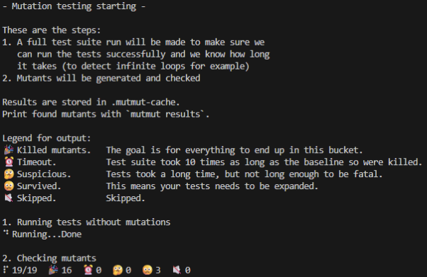

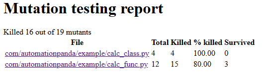


## 6. <a name="_lf8h3cyzrgsq"></a>Referências
BOXED. *mutmut – Mutation testing system*. GitHub, [s.d.]. Disponível em: <https://github.com/boxed/mutmut>. Acesso em: 27 ago. 2025.

HOVMÖLLER, Anders. *mutmut – Python mutation tester*. Read the Docs, 2018. Disponível em: <https://mutmut.readthedocs.io/en/latest/index.html>. Acesso em: 27 ago. 2025.

DEVBTY. Use Teste De Mutação Para Melhorar Sua Bateria De Testes De Software. Disponível em: <https://devbty.com.br/blog/teste-de-mutacao>. Acesso em: 27 ago. 2025.

## 7. <a name="_run"></a>Como executar o projeto

### Clonar repositorio da urllib3

```bash
git clone https://github.com/urllib3/urllib3.git
```

### Criar ambiente virtual

```bash
python -m venv .venv
```

### Ativar ambiente virtual

**Linux:**

```bash
source .venv/bin/activate
```

**Windows:**

```bash
.venv\Scripts\Activate.ps1
```

### Instalar dependências

```bash
pip install -r requirements.txt
```

### Comandos pytest

```bash

# Executar todos os testes
pytest -vv 

# Executar testes com cobertura
pytest -vv --cov=com/automationpanda/example

# Executar testes com report
pytest -vv --cov=com/automationpanda/example --cov-report html

# Executar testes de mutação
mutmut run
```